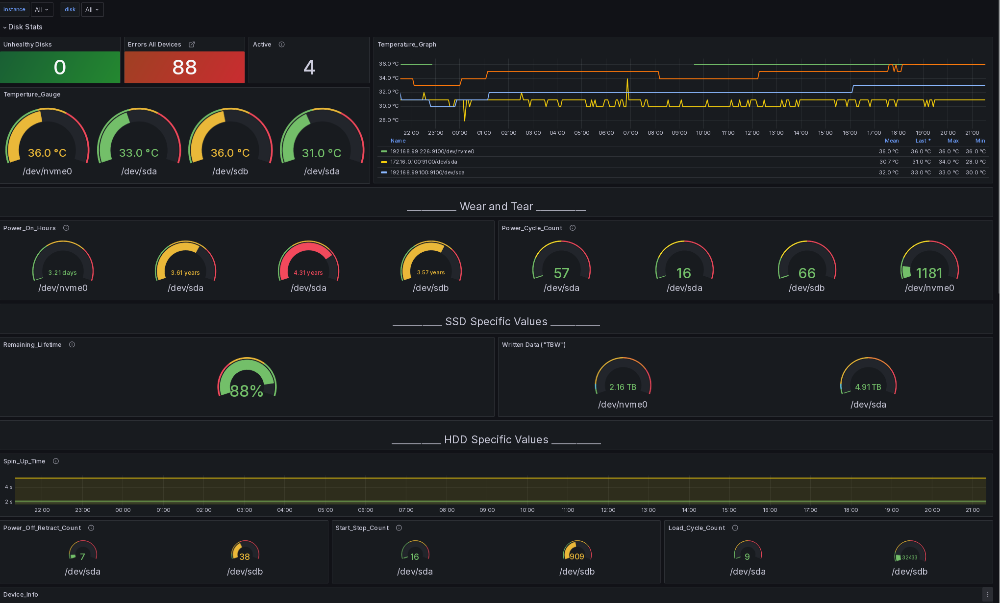

# S.M.A.R.T. disk monitoring for Prometheus
_SMART Exporter for Prometheus node-exporter_

This script is a specialized tool designed to collect SMART data from various
types of disks (ATA, NVMe) and format it for Prometheus monitoring. To collect
SMART values it uses `smartctl`.  

_Inspired by the great examples of the Prometheus community:_  
[textfile-collector-scripts](https://github.com/prometheus-community/node-exporter-textfile-collector-scripts)
___
It has been specifically developed to work seamlessly with the
SMART Disk Monitoring for Prometheus Dashboard on Grafana.

>
>[https://grafana.com/dashboards/10530](https://grafana.com/dashboards/10530)
>

If you're interested in alternative solutions, you might want to check out the [smartctl_exporter](https://github.com/prometheus-community/smartctl_exporter) project from the Prometheus community.

___
>**Warning:** This script has been rewritten from version 0.1.0 and has breaking changes. Please be aware of the following:
>
>- A lot of renaming has been done
>- The script now uses the JSON output of `smartctl`
>- SCSI support has been dropped

## Prerequisites
Mandatory: 
- Bash
- `jq` (https://jqlang.github.io/jq/download/)
- Root privileges (optional, but required to access SMART data for all disks)

Optional:
- node_exporter
  - text_collector enabled for node_exporter
- Grafana >= 10
- smartmontools >= 7

## Usage
1. Clone the repository:

git clone https://github.com/your-username/smart-disk-exporter.git

2. Make the script executable:

chmod +x smartmon.sh

3. Run the script (use `sudo`):

./smartmon.sh

The script will output the SMART data for all detected disks in Prometheus format.

## (WIP)Install / Uninstall
For convenience this repo contains helper scripts for installing and uninstalling.
Make them executable and run the desired script:

>Note that the script should be executed with root privileges as the path are
>usually not accessible for normal users.

Like this:
```sh
chmod +x install.sh
```
```sh
sudo ./install.sh
```

## Set up Prometheus Node Exporter
To enable `text_collector` set the following flag to `node_exporter`:
- `--collector.textfile.directory /var/lib/node_exporter/textfile_collector`

example:
```sh
/usr/bin/prometheus-node-exporter --collector.textfile.directory /var/lib/node_exporter/textfile_collector/
```

Install [smartmontools](https://www.smartmontools.org/)

UBUNTU: `sudo apt-get install smartmontools`

To enable the text_collector on your system add the following as cronjob or create
a Systemd timer unit like shown in the install.sh script.

The Cronjob will execute the script every five minutes and save the result to
the `text_collector` directory.

Example for UBUNTU:

```sh
sudo crontab -e

*/5 * * * * /usr/local/bin/smartmon.sh > /var/lib/node_exporter/textfile_collector/smart_metrics.prom
```

## Running Locally
If you want to test the exporter locally. For example on a laptop you can move
the exporter to the following directory and run it.
```sh
# execute collector
sudo sh -c 'smartmon.sh > /var/lib/node_exporter/textfile_collector/smart_metrics.prom' 

# let node-exporter run
/usr/bin/prometheus-node-exporter --collector.textfile.directory /var/lib/node_exporter/textfile_collector/
```

## Troubleshooting
To get an up to date version of smartmontools it could be necessary to compile it:
https://www.smartmontools.org/wiki/Download#Installfromthesourcetarball

- check by executing `smartctl --version`

- make smartmon.sh executable

- save it under `/usr/local/bin/smartmon.sh`

- make sure `/var/lib/node_exporter/textfile_collector/` exists
  - `mkdir -p /var/lib/node_exporter/textfile_collector/`


## Development and Testing
### Adding New Metrics
Feel free to adapt this script to your needs. The metrics provided are a subset
of all available, so feel free to add more. If you'd like to add a new metric,
here's a general guide:

1. Identify the new metric you want to add. This can be done by checking the
output of `smartctl -A -j /dev/diskX`, where `X` is the device's name. Look for
the relevant attribute in the JSON output.
2. Modify the appropriate parsing function (`parse_smartctl_attributes_json` for
ATA devices, `parse_smartctl_nvme_attributes_json` for NVMe devices) to add a new `if` statement in the `while` loop to check for the new metric's attribute name.
3. Calculate the new metric's value based on the attribute's value and any relevant conversion factors.
4. Print the new metric in Prometheus format using `printf`.

### Test using bats (bats-core)
How to install and use is best described here: [bats-tutorial](https://bats-core.readthedocs.io/en/stable/tutorial.html)

Run tests with:
```sh
bats test
```

### Generate Coverage
```sh
./run_coverage.sh
```
OR
```sh
kcov --bash-dont-parse-binary-dir \
     --include-path=. \
     /var/tmp/coverage \
     bats -t test/test_smartmon.bats
```

## Run as Container
docker build --network=host -t smartmon .

docker run --privileged -v /var/lib/node_exporter/textfile_collector:/var/lib/node_exporter/textfile_collector --network=host smartmon:latest

Alternatively to --privileged, you can grant the container access to specific disk devices using the --device flag. Here's an example of how you can grant the container access to the /dev/sda and /dev/sdb devices:


## TODO
- create container
- Test install.sh script
